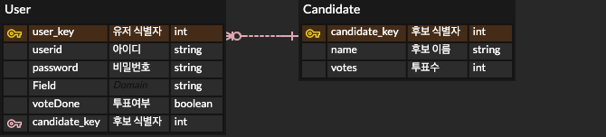
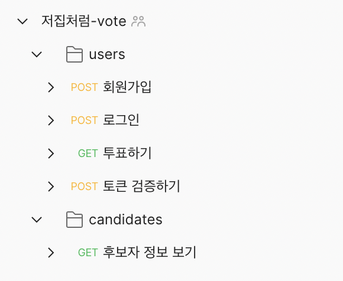

# CEOS 15기 파트장 선거 프로젝트 - 백엔드
## 팀 소개 : TEAM 저집처럼🏠

|  |                                  |  |
| :----------------------------------------------------------------------------: | :------------------------------------------------------------------------------------------------------------: | :----------------------------------------------------------------------------: |
|                                     구본준                                     |                                                     김승우                                                     |                                     김윤지                                     |
|                           <a href ="">@bonjunku</a>                            | <a href ="https://github.com/Like-that-house/django-vote-14th/commits?author=seungwooKim99">@seungwookim99</a> |               <a href ="https://github.com/yoonjiy">@yoonjiy</a>               |
|                                   프론트엔드                                   |                                                     백엔드                                                     |                                     백엔드                                     |

## ER 다이어그램

## API 문서

개발한 API 목록은 위와 같습니다. API를 테스트할 수 있는 문서를 Postman으로 정리했습니다.
[Postman 링크](https://www.getpostman.com/collections/25c511ee513891e65a7c)

## 업무 분담 및 워크 플로우
### 승우
- [x] API 1차 List up
- [x] DB 모델링 및 ERD 제작
- [x] 프로젝트 배포 환경 구축
- [x] Postman API 문서 정리

### 윤지
- [x] 로컬 환경에서 API 개발
- [x] 배포 환경에 코드 옮기기
- [x] API별 요청, 응답 형태 노션에 정리

### Git flow
- `master` : 최종 배포용 브랜치
- `dev` : 개발 내용을 합치고 테스트하는 개발용 브랜치 (master에서 분기)
- `seungwookim` : 승우 작업용 브랜치 (dev에서 분기)
- `yoonji` : 윤지 작업용 브랜치 (dev에서 분기)

`feat/login` 과 같이 기능별로 브랜치를 나눌려했지만, 로컬에서 이미 개발이 완료된 이후에 
작업내용만 배포환경 레포에 옮기면 됐기 때문에 위와 같이 브랜치를 나눴습니다.